Study repository containing the projects from the **iOS & Swift - The Complete iOS App Development Bootcamp** course from Udemy.

Projects / Main Topics | Screenshots
--- | ---
[Project 1](./01.I%20am%20Rich/) - *I am Rich*   Create new project, Icon design and assets                                |  |
[Project 2](./02.I%20Am%20Poor/) - *I am Poor*   Challenge based on lessons from project 01                                             | |
[Project 3](./03.Dicee-iOS13/) - *Dicee*   Variables, Arrays, UIImage, IBOutlet, IBAction                                    | 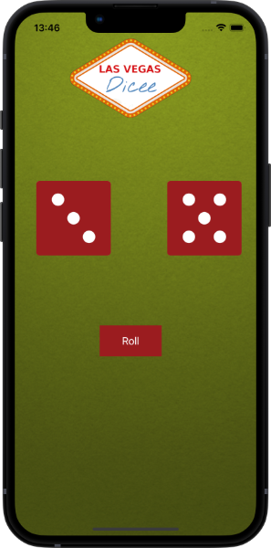 |
[Project 4](./04.Magic-8-Ball-iOS13/) - *Magic 8 Ball*   Challenge based on lessons from project 03                                    | 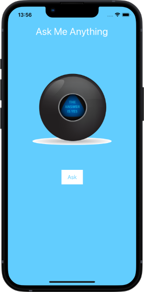 |
[Project 5](./05.AutoLayout-iOS13/) - *Autolayout Dicee*   Autolayout, Constraints, StackViews, Containers                                    | 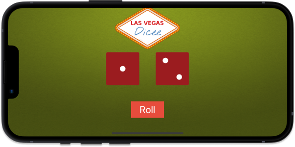 |
[Project 6](./06.Calculator-Layout-iOS13/) - *Calculator*   Challenge based on lessons from project 05                                    | 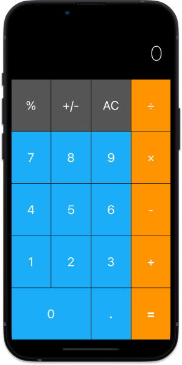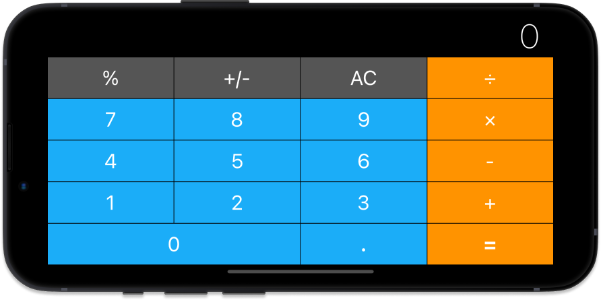 |
[Project 7](./07.Xylophone-iOS13/) - *Xylophone*   Functions, Multiple Actions to a single IBAction, AVFoundation                                   | 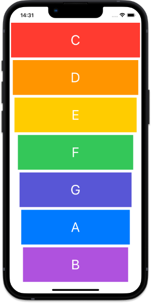 |
[Project 8](./08.EggTimer-iOS13/) - *Egg Timer*   Conditional Statements, Dictionaries, UIProgressView, Debug                                   | 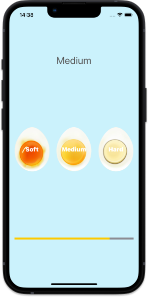 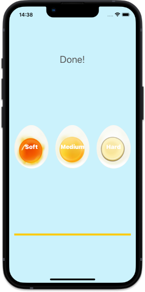 |
[Project 9](./09.Quizzler-iOS13/) - *Quizzler*   Design Patterns, MVC, Immutability, Structs, Value types, Reference types                                  | 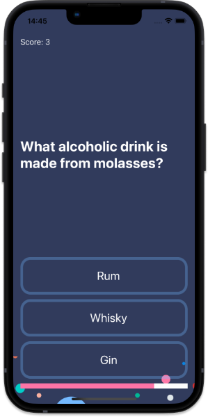 |
[Project 10](./10.Destini-iOS13/) - *Destini*   Challenge based on lessons from project 09                                  | 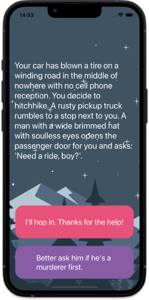 |
[Project 11](./11.BMI-Calculator-iOS13/) - *BMI Calculator*   UISliders, Classes, Segues, Optionals, Color Literal                                | 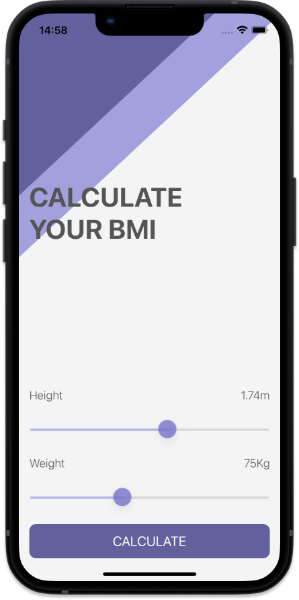 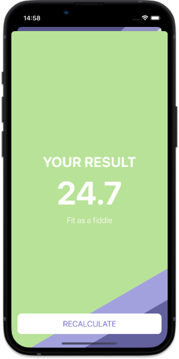  |
[Project 12](./12.Tipsy-iOS13/) - *Tipsy*   Challenge based on lessons from project 11                                | 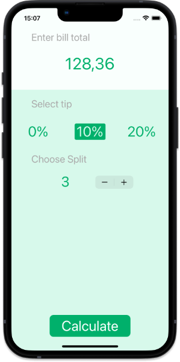 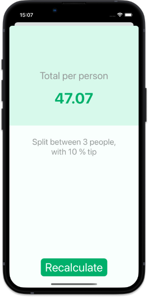  |
[Project 13](./13.Clima-iOS13/) - *Clima*   Dark mode, Delegates, Protocols, HTTP requests from API, JSON Decoder, Computed properties, Closures, Extensions, Core location                           | 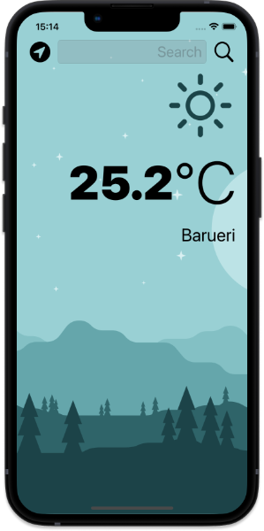 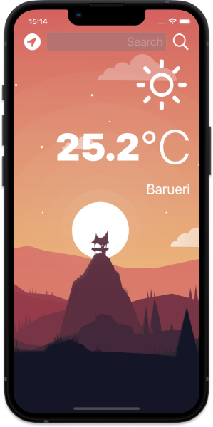  |
[Project 14](./14.ByteCoin-iOS13/) - *Byte Coin*   Challenge based on lessons from project 13                           | 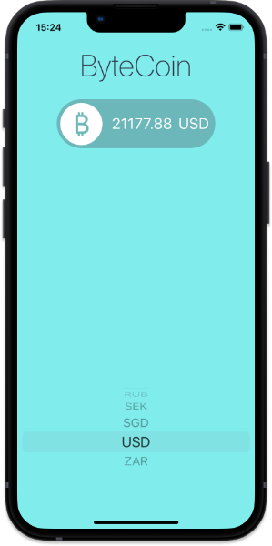 |
[Project 15](./15.Flash-Chat-iOS13/) - *Flash Chat*   Navigation controller, Loops, Cocoapods, Firebase, Firestore, Table views, Xib, Constants file, App lifecycle                           | 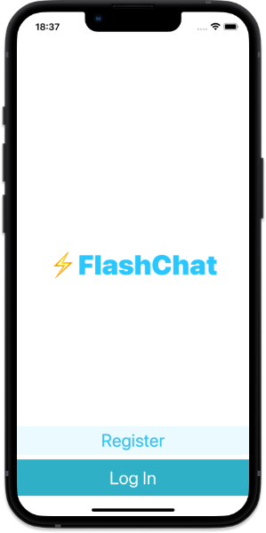 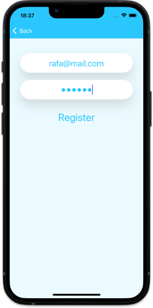 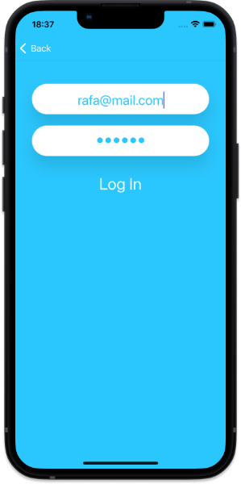 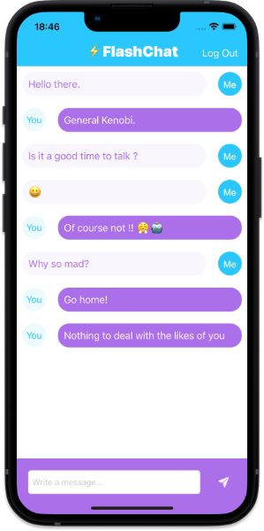 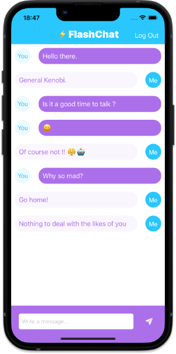|

## Tools

|Link | Description |
|--|--|
| https://app.quicktype.io/ | Convert Json to custom object |

## Design

|Link | Description |
|--|--|
| https://appicon.co/#image-sets | Generate icons and images for iOS/Android development standards | 
| https://colorhunt.co/ | List of color palettes | 
| https://www.canva.com/pt_br/ | Create/Inspirations designs| 
| https://www.simform.com/mobile-patterns/log-in | Example screen patterns | 
| https://unsplash.com/ | Open-source illustrations | 
| https://undraw.co/ | Open-source images | 
| https://fontawesome.com/ | Free icons (a few)| 
| https://imagecolorpicker.com/ | Pick images color/palette |
| https://www.dafont.com/ | Fonts download |

## Documentation

|Link | Description |
|--|--|
| https://www.appbrewery.co/p/ios-course-resources/ | Full list of resources from the iOS course |
| https://www.appbrewery.co/p/appmarketing-course-resources | Full list of resources from the Marketing course |
| https://www.appbrewery.co/p/appdesign-course-resources/ | Full list of resources from the app Design course |
| https://developer.apple.com/documentation/ | Apple API Documentation | 
| https://developer.apple.com/design/human-interface-guidelines/ | Apple Design Documentation | 
| https://docs.swift.org/swift-book/LanguageGuide/TheBasics.html | Swift language guide |
| https://github.com/0nn0/terminal-mac-cheatsheet | Mac terminal shortcut list|